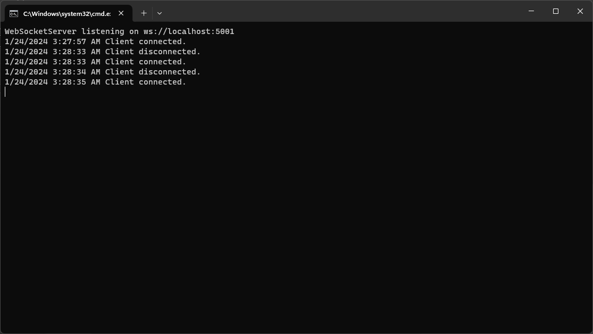
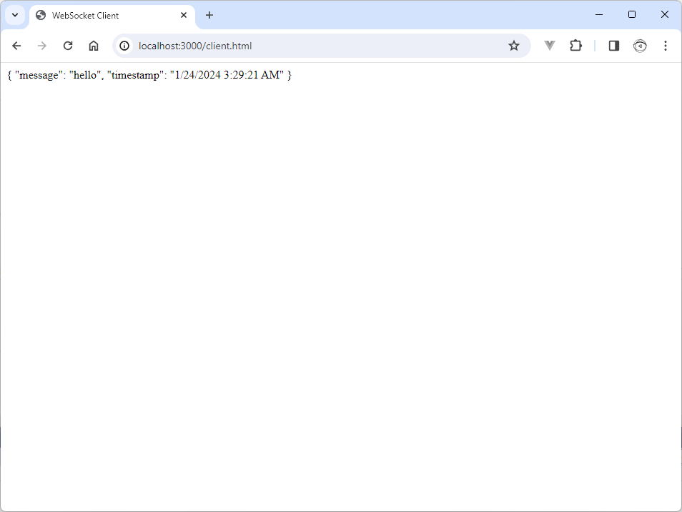

# CSharp WebSocket Server

This project is a C# console app (.NET Framework) that implements a C# WebSocket Server.

## Screenshots

**WebSocket Server (C#)**

[Program.cs](Program.cs)

**WebSocket Client (JS)**

[client.html](client.html)

## Dependencies

* [WebSocket Sharp](https://github.com/sta/websocket-sharp)
